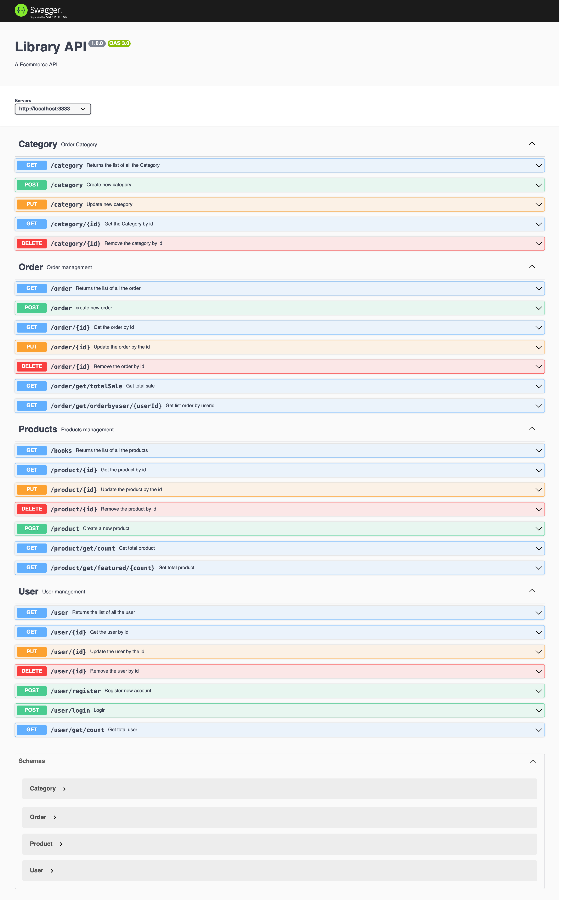

# E-Commerce API with Node JS

## Installation

Download [nodejs](https://nodejs.org/en).

```bash
npm init
npm install express bcryptjs jsonwebtoken cors express-jwt body-parser morgan mongoose

# swagger
npm install swagger-ui-express swagger-jsdoc
```

## Usage

Swaggers

    ```md
    
    ```

## Features

1. Producs
2. Category
3. Authentication/Authorization
4. Order
5. Payment -> Comming soon

## Contact

[Linkedin](https://www.linkedin.com/in/trinhhuynh98/)

[Github](https://github.com/TrinhHuynh98)
